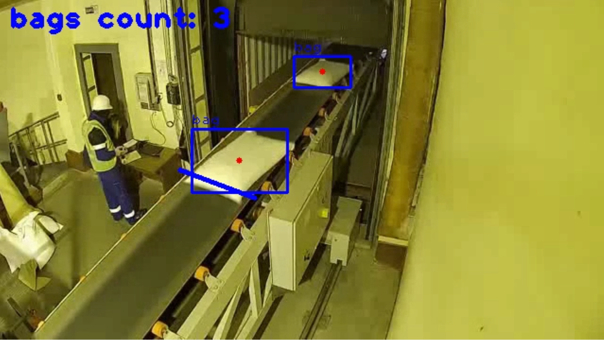

# Bag detection, tracking and counting on conveyor line with YOLO

## Project Overview
This tool helps to detect, track and count bags on conveyor line. Place the video you want to process in data folder. The result video is also saved in data folder with name **output.mp4**

## Run with Docker
From the root directory run

		docker build -t	<name-of-your-image> .
		docker run -v </your/host/absolute/path/to/data/folder>:</data> -e CAP_FILE=<name-of-your-video> <name-of-your-image>

## Result Example

